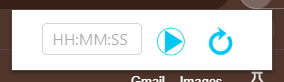
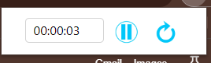
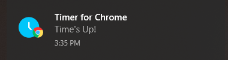

# Timer for Chrome ⏰

Welcome to Timer for Chrome! This extension displays a timer in your browser, which help keep track of time while you are taking a test, or just surfing the internet.

### Chrome Extensions

Chrome extensions are small software programs that customize the browsing experience. 
They enable users to tailor Chrome functionality and behavior to individual needs or preferences. 
They are built on web technologies such as HTML, CSS and JavaScript.
A typical Chrome extension includes

1. A `manifest.json` file, which provides information about the extension to the browser.
2. An optional `content script`, which reads a web page using the standard document-object model, make changes to the page, or pass information to the extension.
3. An optional background script, `background.js`, which run in the background, and is used to maintain the state of the extension.
4. The `popup` files, which are *html, css* and *javascript* files that renders the popup to be displayed.

### Contents

The program contains a [manifest.json](manifest.json) file, which is an essential file for any chrome extension. 
It is a metadata file which provides important information about the extension to the browser, helping it understand how to display the extension to the user.
It contains details like the extension's name, version, permissions, resources used, and other metadata required for the extension to work properly. Here, we are using the latest version of the manifest, Manifest Version 3.

The [background.js](/background.js) is the background script that runs in the background, and is used to maintain the state of the extension. This file is used to keep track of the timer, and to send messages to the [popup.js](/popup.js) to update the display.

The next file is [popup.html](popup.html) which contains the web page or popup to be displayed when the extension is enabled. This HTML is linked to [popup.css](popup.css) (which contains the styles used in the extension) and [popup.js](popup.js), which is the one of the most important file in the program. This file contains the program which is enabling the timer. Functions to calculate the time, update the display and enable buttons in the extensions are included in this file.

A folder, [assets](assets) is included, which contains all the static files used in this project. 

### Installation

1. Clone the repository to your local machine
        
        git clone https://github.com/akshay-rajan/timer.git

2. Go to Chrome and click on the Extensions icon. Now click `Manage Extensions`.

3. Enable `Developer Mode`.

4. Click `Load Unpacked` and choose the folder of the extension.

5. Now the extension can be used from the Chrome Extensions icon.

#### Usage 
There is a field "hh: mm: ss" and two buttons next to it. Set the timer by entering the time in the order 'hour : minute : second' in the above field. The first button is the "start timer" button, and the next one, "reset timer". After entering the duration, click "Start timer" and the timer is started. The first button now works as the "pause timer" button. Click it again to stop the timer. The first button now returns to "start timer". Click the first button to continue running the timer, or the second one to reset the timer.

#### Features
* As the timer runs on the web browser, it uses less resource than external applications.
* The timer is simple to use, and much helpful to students who test themselves using online forms.

 **GitHub:** [Akshay Rajan](https://github.com/akshay-rajan/)